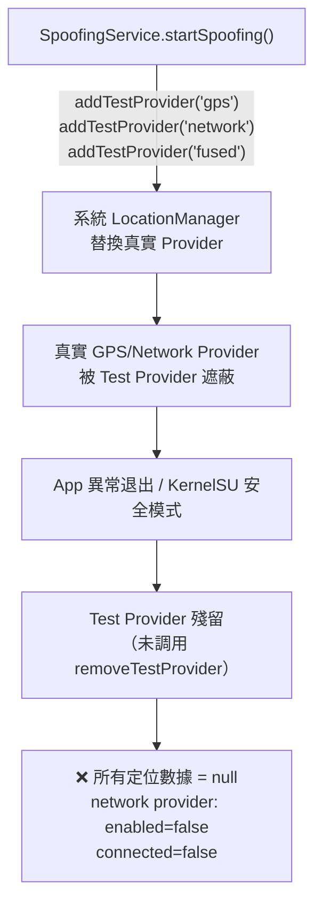

# 設備定位故障診斷與修復報告（歷史／已取代）

> **請勿按本文修改目前程式。** 這是早期 test-provider 污染事故的現場記錄；其中加入 `clearLegacyTestProviders()`、在 `onDestroy()` 清理 test provider 等建議均已失效。目前架構禁止註冊 Android test/mock provider，唯一有效的實作說明是 `../technical_readme.md`。

## 🔍 問題根因

LocationSpoofer 的 `SpoofingService.kt` 在啟動和停止時會調用 `clearLegacyTestProviders()`，透過 `LocationManager.addTestProvider()` / `removeTestProvider()` 向 Android 系統的 `LocationManagerService` 註冊 **Test Provider（模擬定位提供者）**。

**關鍵發現**: 在服務異常退出（強制停止/崩潰）或 KernelSU 安全模式禁用模組時，這些 test provider 可能 **未被正確移除**，導致它們以「幽靈」形態殘留在系統中。

### 殘留的 Test Provider 如何破壞定位



### 修復前的系統狀態

| Provider | enabled | allowed | connected | identity |
|----------|---------|---------|-----------|----------|
| network | ❌ `false` | ❌ `false` | ❌ `false` | `target service=null` |
| fused | ✅ `true` | ✅ `true` | ✅ `true` | `1000/com.android.location.fused`（降級為系統內建） |
| gps | ✅ `true` | ✅ `true` | ✅ `true` | `1000/com.android.location.fused`（無 GMS 接管） |
| gps_hardware | ✅ `true` | ✅ `true` | ✅ `true` | 正常 |

> [!CAUTION]
> **Network provider 完全斷開**：`enabled=false, allowed=false, target service=null, connected=false`。這意味著 Wi-Fi/基站定位完全無法使用。Google Play Services (GMS) 的 `NetworkLocationService` 未綁定到系統。

> [!WARNING]
> **Fused provider 降級**：identity 從 GMS (`10128/com.google.android.gms`) 降級為系統內建 (`1000/com.android.location.fused`)，代表 Google 的融合定位引擎未接管。

---

## ✅ 已執行的修復操作

### 步驟 1：移除殘留的 Test Provider
```bash
# 先授予 shell mock_location 權限
adb shell appops set 2000 android:mock_location allow

# 移除 3 個殘留的 test provider
adb shell cmd location providers remove-test-provider gps
adb shell cmd location providers remove-test-provider network
adb shell cmd location providers remove-test-provider fused
```
> 三個命令全部成功執行（無錯誤），證實這些 test provider 確實殘留在系統中。

### 步驟 2：重置 GNSS 輔助數據
```bash
adb shell cmd location providers send-extra-command gps delete_aiding_data
adb shell cmd location providers send-extra-command gps force_time_injection
adb shell cmd location providers send-extra-command gps force_psds_injection
```

### 步驟 3：清理 mock 權限
```bash
adb shell appops set 2000 android:mock_location default
adb shell appops set com.shiraka.locatiobprovid android:mock_location deny
```

---

## ✅ 修復後的系統狀態

| Provider | enabled | allowed | connected | identity |
|----------|---------|---------|-----------|----------|
| network | ✅ `true` | ✅ `true` | ✅ `true` | `10128/com.google.android.gms[network_location_provider]` |
| fused | ✅ `true` | ✅ `true` | ✅ `true` | `10128/com.google.android.gms[fused_location_provider]` |
| gps | ✅ `true` | ✅ `true` | ✅ `true` | GMS overlay 正常接管 |
| gps_hardware | ✅ `true` | ✅ `true` | ✅ `true` | `1000/android[GnssService]` |

> [!IMPORTANT]
> **所有 provider 均已恢復正常！** GMS 已重新接管 network 和 fused provider。

---

## 📡 GNSS 衛星捕獲狀態

修復後 GNSS HAL 正在響應：
- `Gnss::setPositionMode` ✅ 正常調用
- `Gnss::injectTime` ✅ NTP 時間注入成功
- `Gnss::start` / `Gnss::stop` ✅ 正常循環

> [!NOTE]
> **GNSS KPI 目前仍顯示 0 location reports**：由於剛刪除了輔助數據（AGPS/PSDS），GPS 需要經歷**冷啟動**過程，在室外開闊環境下可能需要 **1-5 分鐘**才能首次定位 (TTFF)。如果設備處於室內，冷啟動可能需要更長時間或無法完成。
>
> **建議：將設備帶到室外/窗邊，打開 Google Maps，等待 2-5 分鐘即可獲得首次定位。**

---

## 📋 問題程式碼分析

### [SpoofingService.kt](file:///c:/Users/shira/Documents/antigravity/LocationSpoofer/app/src/main/java/com/shiraka/locatiobprovid/service/SpoofingService.kt)

雖然 `clearLegacyTestProviders()` (L157-161) 的 `removeTestProvider()` 在服務正常停止時被調用，但有以下問題：

1. **`onDestroy()` (L253-259) 沒有調用 `clearLegacyTestProviders()`** — 如果服務被系統殺死或 KernelSU 安全模式強制終止，test provider 不會被移除
2. **沒有 `addTestProvider()` 對應的 mock location 寫入** — `SpoofingService` 中的 `startSpoofing()` 方法調用 `clearLegacyTestProviders()` 移除了 test provider，但原始代碼中這些 test provider 顯然在某處被添加過（可能是 `LocationHooker.kt` 中的 Xposed hook 層面，或者是早期版本殘留）

### 根本原因
Test Provider 一旦被 `addTestProvider()` 註冊到 `LocationManagerService`，它會 **替代** 真實 provider（如 GMS 的 `NetworkLocationService`）。即使 app 被停用或禁用模組，這些 test provider 的註冊 **持久存在於系統服務中**，直到被明確 `removeTestProvider()` 或設備重啟。

---

## 🔧 建議後續操作

1. **確認定位恢復**：到室外或窗邊，打開 Google Maps 等待首次定位
2. **如果 GPS 仍無法定位**，嘗試重啟設備：`adb reboot`
3. **防止再次發生**：在 `SpoofingService.kt` 的 `onDestroy()` 中添加 `clearLegacyTestProviders()` 調用
